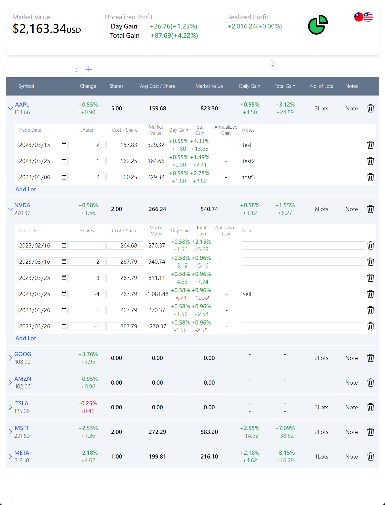
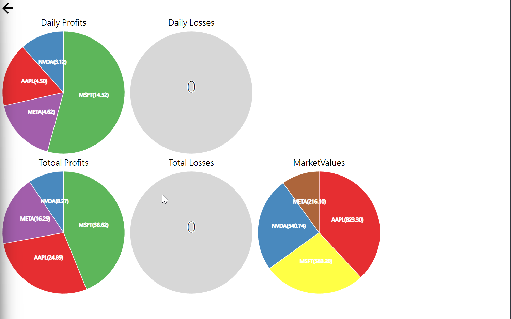
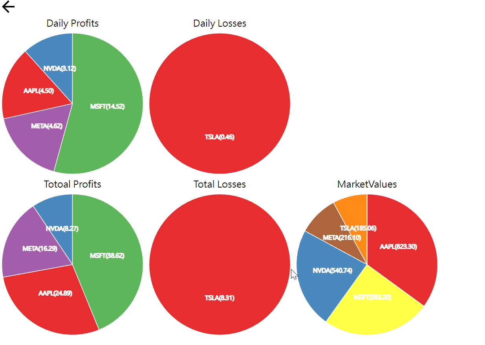

# stock

This is an app designed for US stock investors, providing the latest market quotes, stock information, and news, allowing users to stay on top of market changes and make informed investment decisions.









## Quick Start

build 

```bash
docker compose build
```

run 

```bash
docker compose up -d
```

open http://localhost:5173 in browser

## Development

### Backend Technologies

- Python: developed the backend using the Python programming language.
- SQLAlchemy: used the SQLAlchemy ORM framework to interact with the SQLite database.
- FastAPI: used the FastAPI framework to build the Web API.

### Database

SQLite: used the SQLite database to store user data and related stock information.

### Frontend Technologies

- ReactJS: built the frontend using the ReactJS framework.
- RecoilJS: used RecoilJS for state management.
- 3D.js: used 3D.js to create visualizations for stock information.
- TailwindCSS: used TailwindCSS for fast frontend styling and design.


## Development

Backend 

```bash
cd api
poetry install
make dev
```

Frontend

```bash
cd web
npm install
npm run dev
```
